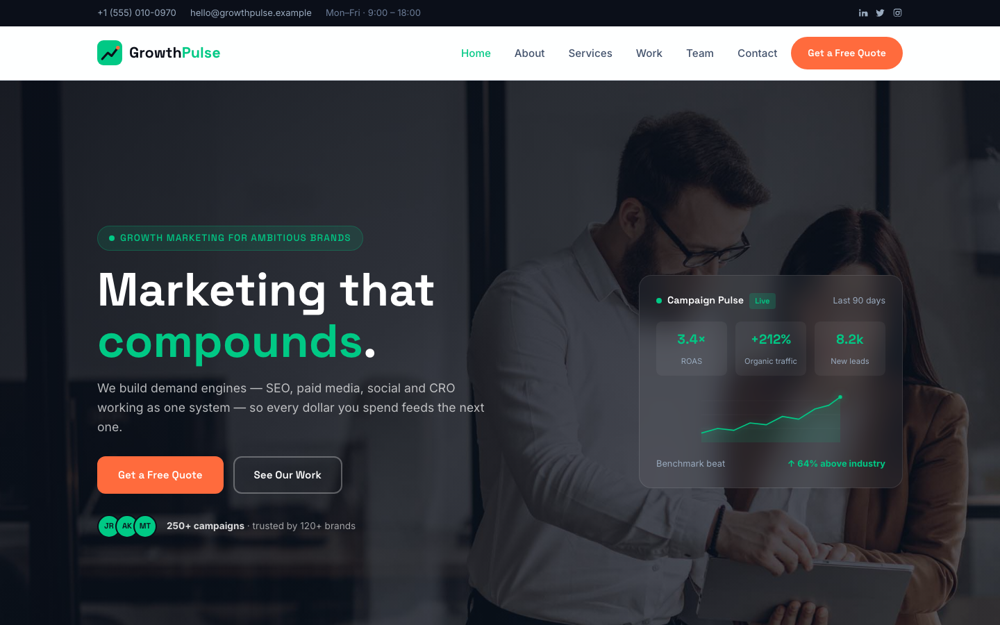

# GrowthPulse — Digital Marketing Agency Template

A premium, framework-free HTML template for a digital marketing agency that positions growth as a compounding system. Ink-black grounds with vivid emerald and tangerine accents, driven by Space Grotesk display type and Inter body text — a confident, data-first presence for an agency running 250+ campaigns across 120+ client brands.

## 📸 Screenshot

## Design System

| Token | Value |
|-------|-------|
| **Ground** | `--clr-bg` `#f4f6fa` (light), `--clr-dark` `#0b0f19` (ink-black) |
| **Primary** | `--clr-primary` `#00c985` (vivid emerald), `--clr-primary-deep` `#009966` |
| **Accent** | `--clr-accent` `#ff6b3d` (tangerine), `--clr-accent-deep` `#e8552a` |
| **Text** | `--clr-ink` `#0b0f19`, `--clr-text` `#41516b`, `--clr-muted` `#9aabbf` |
| **Display type** | `Space Grotesk` (sans, 500–700) |
| **Body type** | `Inter` (sans, 400–700) |
| **Container** | 1200px max-width, centered |
| **Breakpoints** | ~992px (grid collapse), ~768px (mobile nav) |

## Pages

| Page | File | Description |
|------|------|-------------|
| Home | [index.html](index.html) | Hero with crossfade + live campaign dashboard, brand marquee, six services, stats, about, bento work grid, Growth Sprint, testimonials, CTA |
| About | [about.html](about.html) | Company story, experience badge, stats band, core values |
| Services | [service.html](service.html) | Six growth engines, Growth Sprint process, guarantee stats |
| Work | [project.html](project.html) | Bento project gallery and case-study results grid |
| Quote | [quote.html](quote.html) | Free growth audit form with `[data-form]` validation and benefit cards |
| Team | [team.html](team.html) | Four specialists with hover-reveal socials, stats band |
| Contact | [contact.html](contact.html) | Contact form with `[data-form]` validation, info cards, map |
| 404 | [404.html](404.html) | On-brand error page with recovery links |

## Features

- **Framework-free** — pure HTML5, CSS3 (custom properties, Grid, Flexbox, `clamp()`), vanilla JavaScript
- **Growth-agency aesthetic** — ink-black grounds, emerald + tangerine accents, technical display type
- **Fluid responsive** — three breakpoints, no horizontal scroll on any viewport
- **Scroll reveal** — IntersectionObserver-powered `.reveal` animations (respects `prefers-reduced-motion`)
- **Mobile nav** — burger toggle with `aria-expanded` accessible pattern
- **Hero crossfade** — automatic 6s image transition via `.hero-bg img` + `.active` class
- **Campaign dashboard** — hero-sidecard with live KPIs and SVG growth chart
- **Brand marquee** — infinite CSS scroll of client logos/names
- **Bento work grid** — asymmetric tile layout with hover-reveal case-study overlays
- **Growth Sprint** — four-stage process timeline on dark ground
- **Service cards** — icon + tag + body pattern with service-link
- **Team cards** — photo, role label, hover-reveal social icons
- **Form validation** — `[data-form]` hook with `.form-ok` / `.form-err` / `.show` toggle
- **Newsletter form** — footer-embedded form with validation
- **Original imagery** — production-quality marketing photography, no placeholders

## Tech Stack

- HTML5 + CSS3 (W3C-valid, semantic landmarks)
- Vanilla JavaScript (canonical IIFE build)
- Google Fonts (Space Grotesk + Inter)
- SVG favicon (inline data: URI)

## SEO

- Semantic HTML5 structure (`<header>`, `<nav>`, `<main>`, `<section>`, `<footer>`)
- Unique `<title>` and `<meta description>` per page
- `lang="en"` attribute, `charset="utf-8"`, viewport meta
- Alt text on all images

## License

Free for personal and commercial use. Attribution appreciated but not required.

---

## Let's Build Something Together 🚀

[Book a free consultation](https://tally.so/r/q4q1L9)
